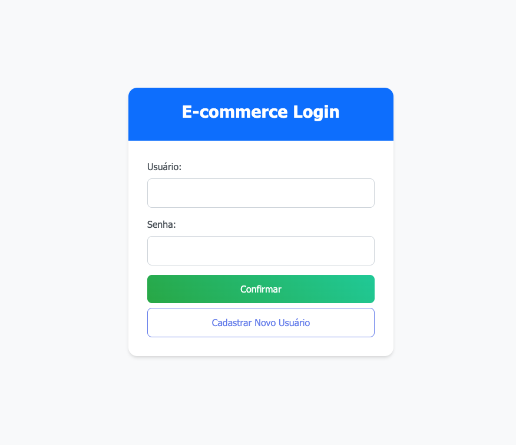
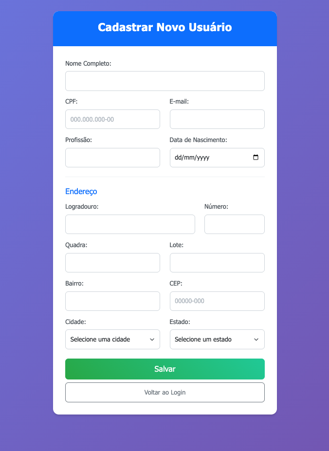

# Sistema de E-commerce - Login e Cadastro

Este projeto implementa um sistema básico de login e cadastro para um e-commerce, desenvolvido como atividade acadêmica.

## 📋 Funcionalidades

### Tela de Login (`index.html`)
- **Campos**: Usuário e Senha
- **Botões**:
  - **Confirmar**: Redireciona para tela de boas-vindas
  - **Cadastrar Novo Usuário**: Redireciona para formulário de cadastro



### Tela de Boas-vindas (`welcome.html`)
- Exibe mensagem "Seja Bem Vindo!" após login bem-sucedido
- Opção para retornar ao login


### Tela de Cadastro (`cadastro.html`)
- **Campos Pessoais**: Nome, CPF, E-mail, Profissão, Data de Nascimento
- **Campos de Endereço**: Logradouro, Número, Quadra, Lote, Bairro, CEP, Cidade, Estado
- **Botão Salvar**: Retorna à tela de login (sem processamento de dados)
- **Validação**: Campos obrigatórios com feedback visual
- **Formatação**: CPF e CEP com máscaras automáticas



## 🎨 Tecnologias Utilizadas

- **HTML5**: Estrutura semântica das páginas
- **CSS3**: Estilos customizados com gradientes e animações
- **Bootstrap 5.3**: Framework CSS para responsividade e componentes
- **JavaScript**: Interatividade e validações do lado cliente

## 🚀 Como Visualizar o Projeto

### Opção 1: Abrir Diretamente no Navegador
1. Navegue até a pasta do projeto
2. Clique duas vezes no arquivo `index.html`
3. O projeto será aberto no navegador padrão

## 📁 Estrutura do Projeto

```
atv-1/
├── index.html          # Página de login
├── welcome.html        # Página de boas-vindas
├── cadastro.html       # Formulário de cadastro
├── styles.css          # Estilos customizados
├── script.js           # Funcionalidades JavaScript
└── README.md           # Este arquivo
```

## 🔧 Funcionalidades Técnicas

### Validações JavaScript
- Verificação de campos obrigatórios
- Formatação automática de CPF (000.000.000-00)
- Formatação automática de CEP (00000-000)
- Validação de formato de e-mail
- Feedback visual com classes Bootstrap

### Responsividade
- Layout adaptável para dispositivos móveis
- Sistema de grid Bootstrap
- Componentes responsivos

### Estilização
- Tema moderno com gradientes
- Animações suaves
- Estados de hover e focus
- Classes CSS customizadas e Bootstrap

## 📱 Navegação do Sistema

1. **Página Inicial**: `index.html` (Login)
2. **Após clicar "Confirmar"**: `welcome.html` (Boas-vindas)
3. **Após clicar "Cadastrar Novo Usuário"**: `cadastro.html`
4. **Após clicar "Salvar" no cadastro**: Retorna para `index.html`

## ⚠️ Observações Importantes

- Este é um projeto educacional **sem backend**
- Os dados do formulário **não são salvos**
- A validação de login aceita **qualquer usuário/senha**
- Funciona completamente **offline**
- Compatível com navegadores modernos

## 👨‍💻 Desenvolvedor

Projeto desenvolvido como atividade acadêmica para demonstrar conhecimentos em HTML, CSS, JavaScript e Bootstrap.

---

**Para visualizar o projeto, abra o arquivo `index.html` em seu navegador preferido!** 🌐