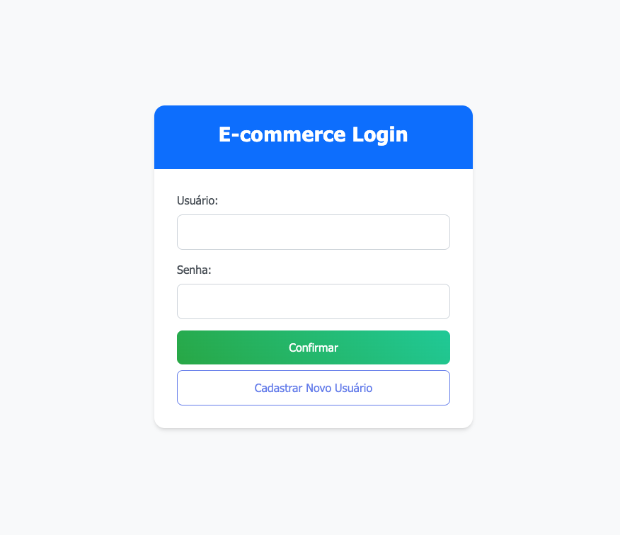
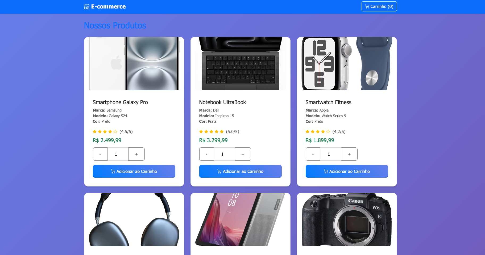
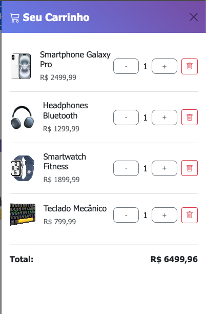
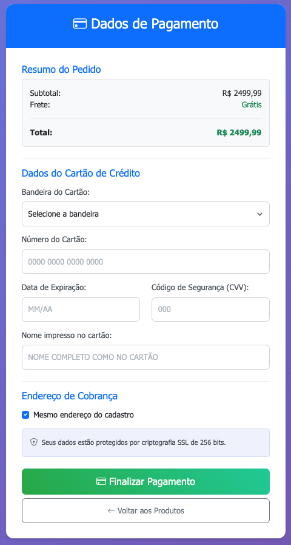
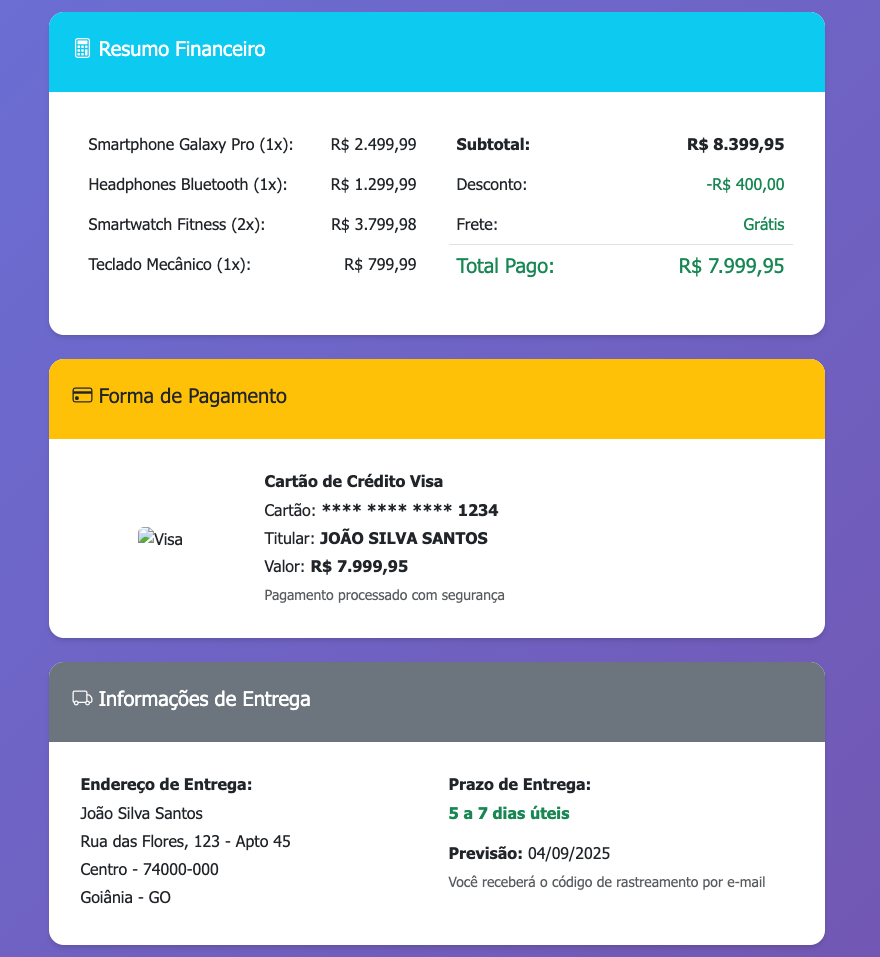
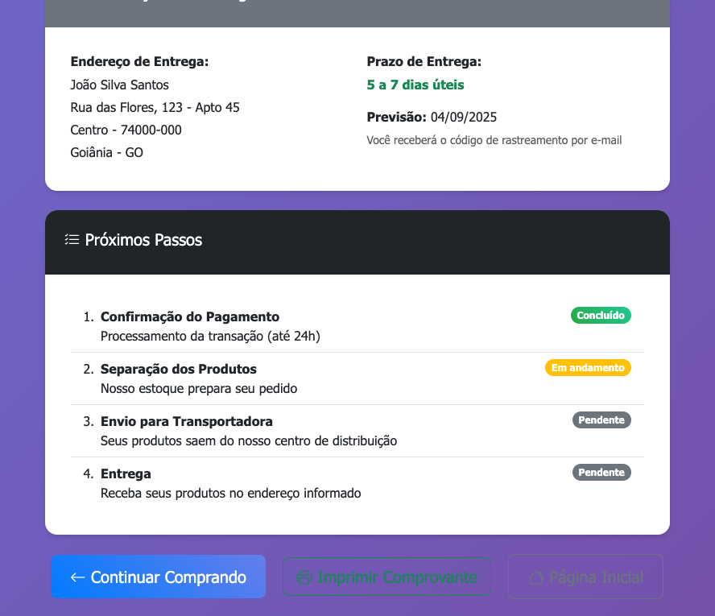

# Sistema de E-commerce Completo - Login, Produtos, Pagamento e Finalização

Este projeto implementa um sistema completo de e-commerce com funcionalidades de login, catálogo de produtos, carrinho de compras, pagamento e finalização da compra, desenvolvido como atividade acadêmica.

## 📋 Funcionalidades Implementadas

### 🔐 Tela de Login (`index.html`)
- **Campos**: Usuário e Senha
- **Botões**:
  - **Confirmar**: Redireciona para página de produtos
  - **Cadastrar Novo Usuário**: Redireciona para formulário de cadastro
- **Validação**: Campos obrigatórios com feedback




### 🛍️ Tela de Produtos (`produtos.html`)
- **Lista de Produtos**: 10 produtos com informações completas
  - Foto do produto (placeholder)
  - Nome do produto
  - Valor do produto
  - Detalhes (marca, modelo, cor)
  - Sistema de quantidade (1-10 unidades)
  - Avaliação do produto (estrelas)



- **Carrinho de Compras**: Offcanvas lateral com produtos selecionados
- **Funcionalidades**:
  - Adicionar produtos ao carrinho
  - Alterar quantidade de produtos
  - Visualizar total do carrinho
  - Botão "Finalizar Compra" (habilitado apenas com itens no carrinho)



### 💳 Tela de Pagamento (`pagamento.html`)
- **Resumo do Pedido**: Subtotal, frete grátis e total
- **Dados do Cartão de Crédito**:
  - Bandeira do cartão (Visa, Mastercard, American Express)
  - Número do cartão com formatação automática
  - Data de expiração (MM/AA)
  - Código de segurança (CVV)
  - Nome impresso no cartão (maiúsculas automáticas)
- **Endereço de Cobrança**: Opção de usar o mesmo endereço do cadastro
- **Validações**: Formato de cartão, data e CVV
- **Segurança**: Indicador de criptografia SSL



### ✅ Tela de Finalização (`finalizacao.html`)
- **Mensagem de Sucesso**: Confirmação da compra realizada
- **Número do Pedido**: Gerado automaticamente
- **Data da Compra**: Data atual
- **Produtos Comprados**: Lista detalhada com dados fictícios
- **Resumo Financeiro**: Breakdown completo dos valores
- **Forma de Pagamento**: Dados do cartão mascarados
- **Informações de Entrega**: Endereço e prazo de entrega
- **Próximos Passos**: Timeline do processamento do pedido
- **Botões**: Continuar comprando, imprimir comprovante, página inicial





### 📝 Tela de Cadastro (`cadastro.html`)
- **Campos Pessoais**: Nome, CPF, E-mail, Profissão, Data de Nascimento
- **Campos de Endereço**: Logradouro, Número, Quadra, Lote, Bairro, CEP, Cidade, Estado
- **Validações**: Campos obrigatórios, formatação de CPF e CEP
- **Redirecionamento**: Retorna ao login após cadastro

## 🎨 Tecnologias Utilizadas

- **HTML5**: Estrutura semântica das páginas
- **CSS3**: Estilos customizados com gradientes e animações
- **Bootstrap 5.3**: Framework CSS para responsividade e componentes
- **Bootstrap Icons**: Ícones para interface
- **JavaScript ES6**: Interatividade e validações do lado cliente
- **LocalStorage**: Persistência do carrinho de compras

## 🚀 Como Visualizar o Projeto

### Opção 1: Abrir Diretamente no Navegador
1. Navegue até a pasta `atv-2`
2. Clique duas vezes no arquivo `index.html`
3. O projeto será aberto no navegador padrão

## 📁 Estrutura do Projeto

```
atv-2/
├── index.html           # Página de login
├── cadastro.html        # Formulário de cadastro
├── produtos.html        # Catálogo de produtos
├── pagamento.html       # Formulário de pagamento
├── finalizacao.html     # Confirmação da compra
├── styles.css           # Estilos customizados
├── script.js            # Funcionalidades JavaScript
├── images/              # Capturas de tela da documentação
└── README.md            # Este arquivo
```

## 🔧 Funcionalidades Técnicas

### Validações JavaScript
- **Login**: Verificação de campos obrigatórios
- **Cadastro**: 
  - Formatação automática de CPF (000.000.000-00)
  - Formatação automática de CEP (00000-000)
  - Validação de formato de e-mail
  - Feedback visual com classes Bootstrap
- **Produtos**: Controle de quantidade (1-10 unidades)
- **Pagamento**:
  - Formatação de número de cartão (0000 0000 0000 0000)
  - Validação de data de expiração (MM/AA)
  - Controle de CVV (3-4 dígitos conforme bandeira)
  - Nome em maiúsculas automáticas

### Carrinho de Compras
- **Persistência**: Dados salvos em LocalStorage
- **Funcionalidades**:
  - Adicionar produtos
  - Alterar quantidades
  - Remover itens
  - Calcular totais automaticamente
  - Interface offcanvas responsiva

### Responsividade
- Layout adaptável para dispositivos móveis
- Sistema de grid Bootstrap
- Componentes responsivos
- Otimizado para tablets e smartphones

### Estilização
- Tema moderno com gradientes
- Animações suaves (hover, focus, loading)
- Estados visuais para validações
- Cards com efeito hover nos produtos
- Paleta de cores consistente

## 📱 Fluxo de Navegação do Sistema

```
1. Login (index.html)
   ├── Cadastrar → cadastro.html → volta para login
   └── Confirmar → produtos.html
                   └── Finalizar Compra → pagamento.html
                                        └── Finalizar Pagamento → finalizacao.html
                                                                  ├── Continuar Comprando → produtos.html
                                                                  └── Página Inicial → index.html
```

## 🛒 Produtos Disponíveis (Fictícios)

1. **Smartphone Galaxy Pro** - R$ 2.499,99
2. **Notebook UltraBook** - R$ 3.299,99
3. **Smartwatch Fitness** - R$ 1.899,99
4. **Headphones Bluetooth** - R$ 1.299,99
5. **Tablet Ultra HD** - R$ 2.799,99
6. **Câmera Digital DSLR** - R$ 1.999,99
7. **Console PlayStation 5** - R$ 4.199,99
8. **Mouse Gamer RGB** - R$ 299,99
9. **Teclado Mecânico** - R$ 799,99
10. **Monitor 4K UltraWide** - R$ 2.199,99

## 💡 Melhorias Implementadas

### Em relação ao projeto original (atv-1):
- **Fluxo completo de compra**: Do login à finalização
- **Carrinho persistente**: Dados mantidos entre sessões
- **Validações avançadas**: Formato de cartão, CPF, e-mail
- **Interface moderna**: Cards com hover, offcanvas, toasts
- **Responsividade melhorada**: Layout otimizado para mobile
- **Feedback visual**: Loading states, validações em tempo real
- **Dados fictícios realistas**: Produtos e informações de compra

## ⚠️ Observações Importantes

- Este é um projeto educacional **sem backend**
- Os dados do formulário **não são salvos** permanentemente
- A validação de login aceita **qualquer usuário/senha**
- O processamento de pagamento é **simulado** (2s de delay)
- Todos os produtos e dados de finalização são **fictícios**
- Funciona completamente **offline** após carregamento inicial
- Compatível com navegadores modernos

## 👨‍💻 Desenvolvedor

Projeto desenvolvido como atividade acadêmica para demonstrar conhecimentos em desenvolvimento front-end com HTML, CSS, JavaScript e Bootstrap, implementando um sistema completo de e-commerce.

---

**Para visualizar o projeto, abra o arquivo `index.html` em seu navegador preferido e siga o fluxo de navegação!** 🌐