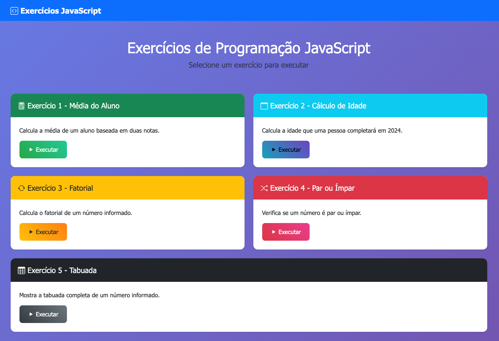
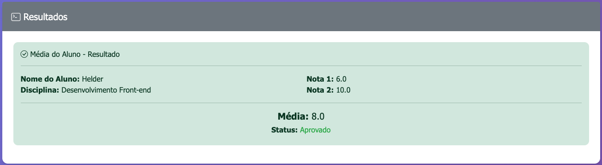
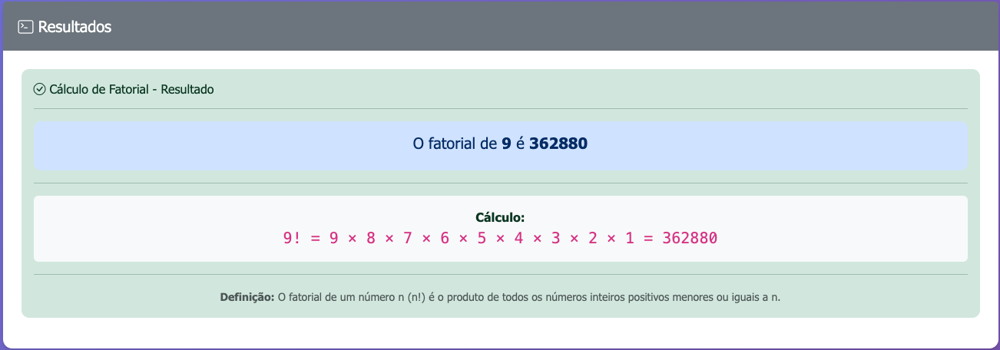
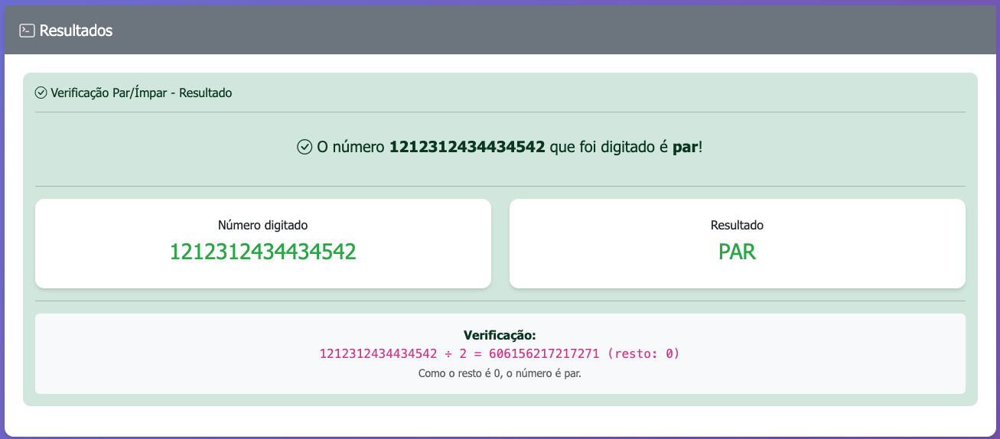
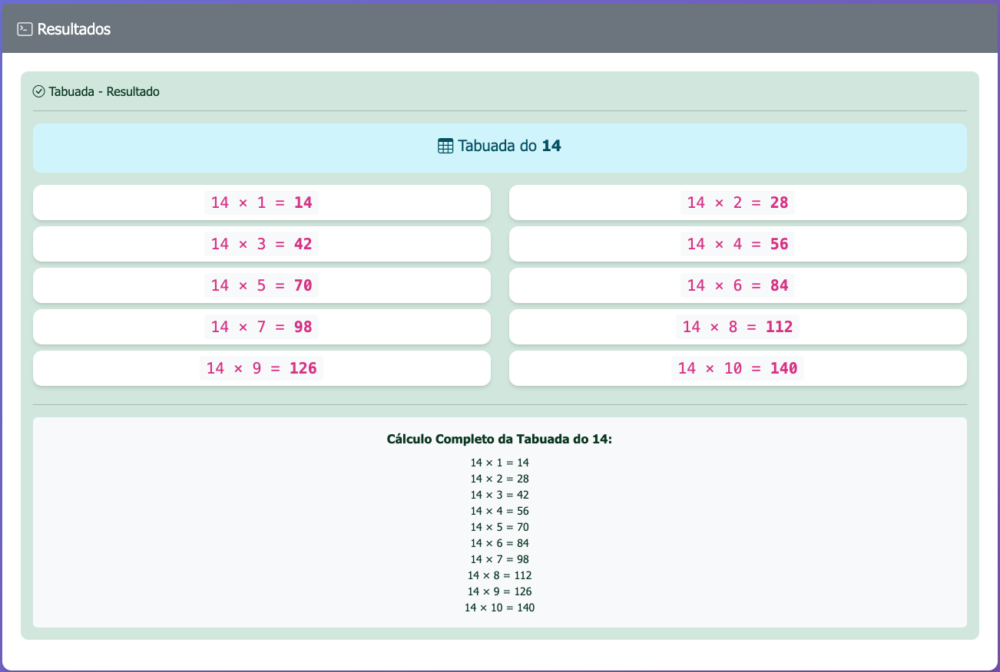

# Exercícios de Programação JavaScript - ATV-3

Este projeto implementa 5 exercícios de programação em JavaScript, desenvolvido como atividade acadêmica para demonstrar conhecimentos em lógica de programação e manipulação do DOM.



## 📋 Exercícios Implementados

### 🧮 **Exercício 1 - Média do Aluno** (2,0 pontos)
**Descrição:** Calcula a média de um aluno baseada em duas notas.

**Funcionalidades:**
- Solicita nome do aluno
- Solicita nome da disciplina  
- Solicita nota 1 e nota 2
- Calcula e exibe a média
- Determina status (Aprovado/Recuperação/Reprovado)
- Validação de dados de entrada



### 📅 **Exercício 2 - Cálculo de Idade** (2,0 pontos)
**Descrição:** Calcula a idade que uma pessoa completará em 2024.

**Funcionalidades:**
- Solicita ano de nascimento
- Calcula idade em 2024
- Valida entrada (anos entre 1900-2024)
- Mostra idade atual também


### 🔢 **Exercício 3 - Cálculo de Fatorial** (2,0 pontos)
**Descrição:** Calcula o fatorial de um número informado.

**Funcionalidades:**
- Solicita um número
- Calcula fatorial usando recursão
- Mostra cálculo passo a passo
- Validação para números não negativos
- Proteção contra overflow (máximo 20)



### 🔄 **Exercício 4 - Par ou Ímpar** (2,0 pontos)
**Descrição:** Verifica se um número é par ou ímpar.

**Funcionalidades:**
- Solicita um número
- Verifica se é par ou ímpar usando módulo
- Mostra explicação matemática
- Interface visual diferenciada



### 📊 **Exercício 5 - Tabuada** (2,0 pontos)
**Descrição:** Mostra a tabuada completa de um número.

**Funcionalidades:**
- Solicita um número
- Gera tabuada de 1 a 10
- Interface organizada em cards
- Validação de entrada



## 🎨 Tecnologias Utilizadas

- **HTML5**: Estrutura semântica da página
- **CSS3**: Estilos customizados com gradientes e animações
- **Bootstrap 5.3**: Framework CSS para responsividade e componentes
- **Bootstrap Icons**: Ícones para interface
- **JavaScript ES6**: Lógica de programação e manipulação do DOM

## 🚀 Como Visualizar o Projeto

### Opção 1: Abrir Diretamente no Navegador
1. Navegue até a pasta `atv-3`
2. Clique duas vezes no arquivo `index.html`
3. O projeto será aberto no navegador padrão

## 📁 Estrutura do Projeto

```
atv-3/
├── index.html          # Página principal com interface
├── script.js           # Implementação dos 5 exercícios
├── styles.css          # Estilos customizados
└── README.md           # Este arquivo
```

## 🔧 Funcionalidades Técnicas

### Validações Implementadas
- **Exercício 1**: Validação de notas (0-10), campos obrigatórios
- **Exercício 2**: Validação de ano (1900-2024)
- **Exercício 3**: Validação de números não negativos, proteção overflow
- **Exercício 4**: Validação de números inteiros
- **Exercício 5**: Validação de números dentro de limites (-100 a 100)

### Recursos Visuais
- Interface moderna com Bootstrap
- Cards interativos com hover effects
- Área de resultados dinâmica
- Animações suaves
- Design responsivo
- Códigos de cores por exercício
- Ícones contextuais

### Tratamento de Erros
- Try-catch em todos os exercícios
- Mensagens de erro amigáveis
- Validação de entrada robusta
- Prevenção de casos extremos

## 💡 Recursos Adicionais Implementados

### Além dos requisitos básicos:
- **Interface Gráfica**: Sistema completo com Bootstrap ao invés de apenas console
- **Validações Avançadas**: Múltiplas verificações de entrada
- **Feedback Visual**: Status colorido, ícones e cards organizados
- **Responsividade**: Layout adaptado para dispositivos móveis
- **Animações**: Transições suaves e efeitos visuais
- **Cálculos Extras**: Informações adicionais em cada exercício
- **Scroll Suave**: Navegação automática para resultados

## ⚠️ Observações Importantes

- Este é um projeto educacional **sem backend**
- Todos os cálculos são realizados **no cliente (JavaScript)**
- Interface completamente **funcional offline**
- Validações robustas para **prevenir erros**
- Compatível com **navegadores modernos**
- Design **responsivo** para dispositivos móveis

## 🎨 Design e Usabilidade

- **Cores temáticas** para cada exercício
- **Layout card-based** para organização
- **Área de resultados** dinâmica e visual
- **Feedback imediato** em caso de erros
- **Animações suaves** para melhor experiência
- **Tipografia clara** e legível

## 👨‍💻 Desenvolvedor

Projeto desenvolvido como atividade acadêmica para demonstrar conhecimentos em:
- Lógica de programação JavaScript
- Manipulação do DOM
- Validação de dados
- Design de interface
- Responsividade web

---

**Para visualizar o projeto, abra o arquivo `index.html` em seu navegador e teste os exercícios!** 🌐