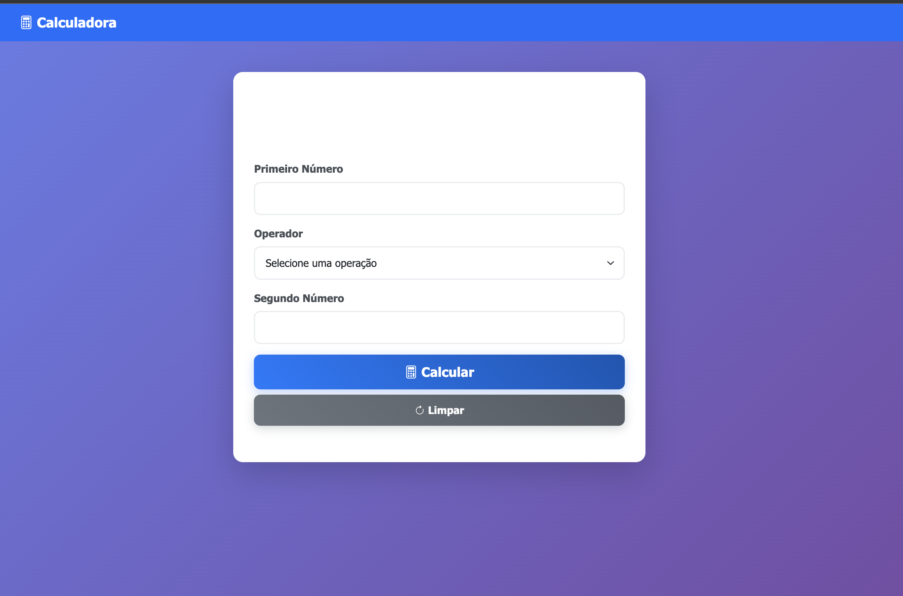
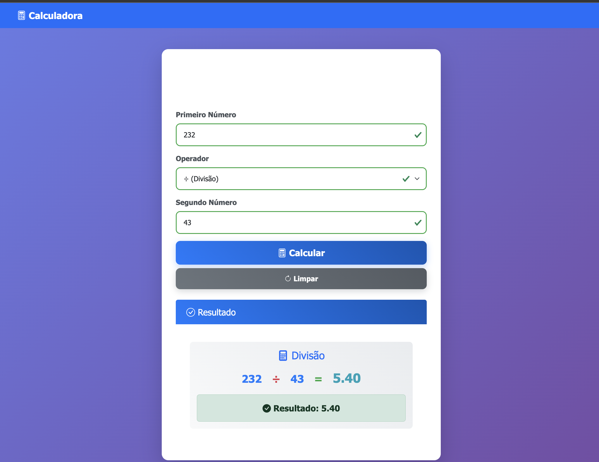
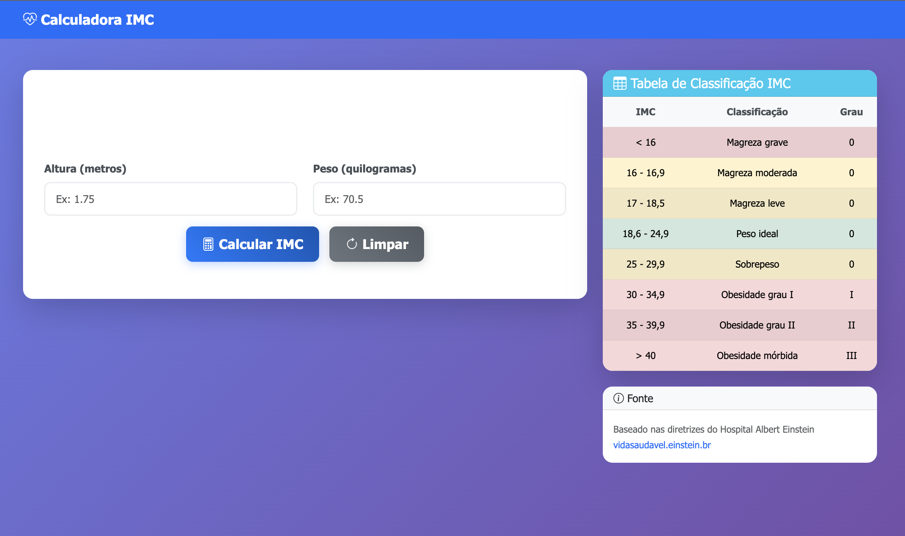
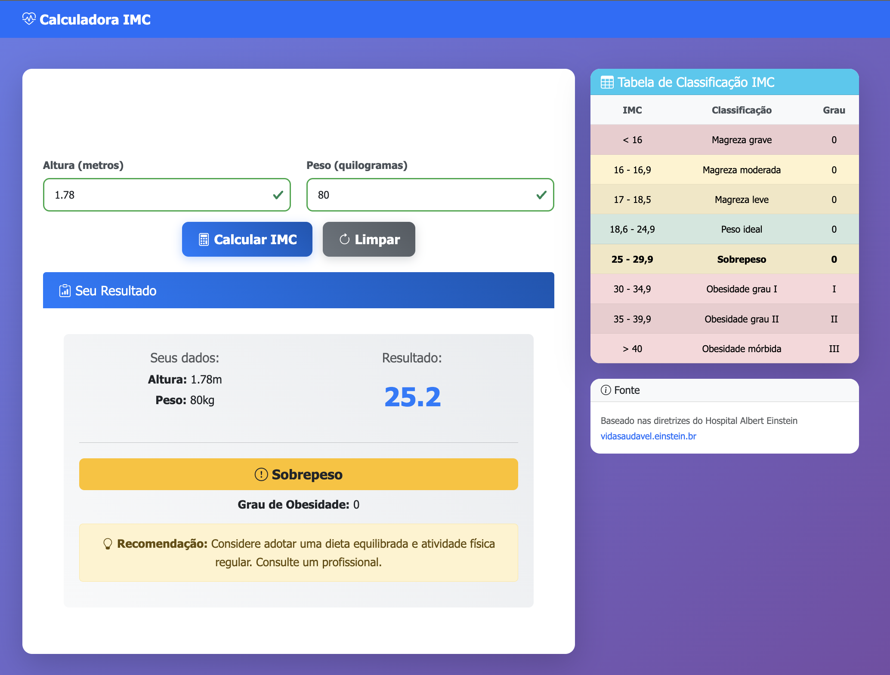
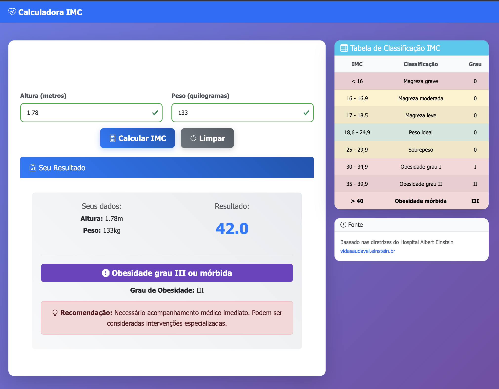

# Calculadoras Web - ATV-4

Este projeto implementa duas calculadoras web interativas: uma calculadora básica de operações matemáticas e uma calculadora de IMC (Índice de Massa Corporal), desenvolvidas como atividade acadêmica para demonstrar conhecimentos em JavaScript, validação de formulários e design responsivo.

## 📋 Projetos Implementados

### 🧮 **Calculadora Básica**
**Localização:** `calculadora/index.html`
**Descrição:** Calculadora para operações matemáticas básicas entre dois números.

**Funcionalidades:**
- Campo numérico para o primeiro número
- Seletor de operação (+, -, ×, ÷)
- Campo numérico para o segundo número
- Botão "Calcular" para executar a operação``
- Botão "Limpar" para resetar todos os campos
- Exibição do resultado com formatação visual
- Validações robustas de entrada
- Proteção contra divisão por zero

**Validações Implementadas:**
- Verificação de campos obrigatórios
- Validação de números válidos
- Verificação de seleção de operador
- Proteção específica contra divisão por zero
- Feedback visual em tempo real (verde/vermelho)
- Mensagens de erro descritivas




### 🩺 **Calculadora de IMC**
**Localização:** `calculadora-imc/index.html`
**Descrição:** Calculadora de Índice de Massa Corporal com classificação completa e tabela de referência.

**Funcionalidades:**
- Campo para altura em metros (0.5m a 3.0m)
- Campo para peso em quilogramas (20kg a 500kg)
- Botão "Calcular IMC" para processar os dados
- Botão "Limpar" para resetar formulário
- Exibição do valor do IMC calculado
- Classificação automática da situação de peso
- Indicação do grau de obesidade (0, I, II, III)
- Tabela de referência sempre visível
- Destaque da faixa correspondente na tabela
- Recomendações personalizadas por categoria

**Classificações do IMC (baseadas no Hospital Einstein):**
- **< 16**: Magreza grave (Grau 0)
- **16 - 16,9**: Magreza moderada (Grau 0)
- **17 - 18,5**: Magreza leve (Grau 0)
- **18,6 - 24,9**: Peso ideal (Grau 0)
- **25 - 29,9**: Sobrepeso (Grau 0)
- **30 - 34,9**: Obesidade grau I (Grau I)
- **35 - 39,9**: Obesidade grau II ou severa (Grau II)
- **> 40**: Obesidade grau III ou mórbida (Grau III)

**Validações Implementadas:**
- Altura: valores entre 0.5m e 3.0m
- Peso: valores entre 20kg e 500kg
- Formatação automática (altura: 2 decimais, peso: 1 decimal)
- Validação em tempo real durante digitação
- Feedback visual com cores (verde/vermelho)
- Mensagens de erro específicas por campo

**Recursos Especiais:**
- Tabela de classificação com cores diferenciadas
- Animação de destaque na linha correspondente
- Recomendações médicas por categoria
- Link para fonte oficial (Hospital Einstein)
- Scroll automático para visualização dos resultados
- Design adaptado para dispositivos móveis





## 🎨 Tecnologias Utilizadas

- **HTML5**: Estrutura semântica e acessível
- **CSS3**: Estilos avançados com gradientes, animações e responsividade
- **Bootstrap 5.3**: Framework para componentes e grid system
- **Bootstrap Icons**: Ícones contextuais para melhor UX
- **JavaScript ES6**: Lógica de validação, cálculos e interatividade
- **Responsive Design**: Layout adaptável para todos os dispositivos

## 🚀 Como Visualizar os Projetos

### Calculadora Básica
1. Navegue até `dev-front-end/atv-4/calculadora/`
2. Abra o arquivo `index.html` no navegador
3. Teste as operações matemáticas

### Calculadora de IMC
1. Navegue até `dev-front-end/atv-4/calculadora-imc/`
2. Abra o arquivo `index.html` no navegador
3. Insira altura e peso para ver o resultado

## 📁 Estrutura do Projeto

```
atv-4/
├── calculadora/
│   ├── index.html          # Interface da calculadora básica
│   ├── script.js           # Lógica de cálculos e validações
│   └── styles.css          # Estilos customizados
├── calculadora-imc/
│   ├── index.html          # Interface da calculadora IMC
│   ├── script.js           # Lógica IMC, classificações e tabela
│   └── styles.css          # Estilos responsivos e animações
└── README.md               # Este arquivo
```

## 🔧 Funcionalidades Técnicas Avançadas

### Calculadora Básica
- **Validação em Tempo Real**: Campos ficam verde/vermelho conforme preenchimento
- **Prevenção de Erros**: Proteção contra divisão por zero com mensagem específica
- **Formatação de Resultado**: Números decimais limitados a 2 casas
- **Interface Responsiva**: Layout adapta-se a telas pequenas
- **Feedback Visual**: Botão "Limpar" muda cor temporariamente
- **Acessibilidade**: Labels associados e mensagens descritivas

### Calculadora IMC
- **Formatação Automática**: Altura (2 decimais) e peso (1 decimal)
- **Destaque Dinâmico**: Linha da tabela correspondente fica destacada
- **Classificação Colorida**: Cada faixa de IMC tem cor específica
- **Scroll Inteligente**: Página rola automaticamente para mostrar resultados
- **Recomendações Médicas**: Texto personalizado para cada classificação
- **Validação Rigorosa**: Limites realistas para altura e peso
- **Fonte Confiável**: Baseado nas diretrizes do Hospital Einstein

### Design e UX
- **Gradientes Modernos**: Background com gradiente azul/roxo
- **Animações Suaves**: Transições em hover, focus e carregamento
- **Cards Interativos**: Efeitos de elevação no hover
- **Tipografia Moderna**: Fonte Segoe UI para melhor legibilidade
- **Estados Visuais**: Feedback claro para todos os estados dos campos
- **Mobile First**: Design pensado primeiramente para dispositivos móveis

## 👨‍💻 Desenvolvedor

Projeto desenvolvido como atividade acadêmica para demonstrar conhecimentos em:
- Desenvolvimento web front-end
- JavaScript para validação e cálculos
- Design de interface responsiva
- Experiência do usuário (UX)
- Implementação de regras de negócio

---

**Para visualizar os projetos, abra os arquivos `index.html` de cada pasta no navegador e teste as funcionalidades!** 🌐