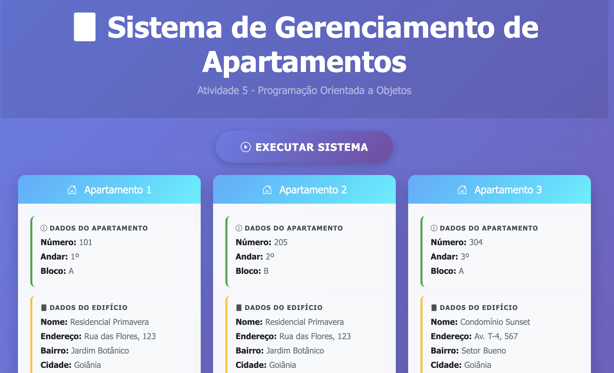
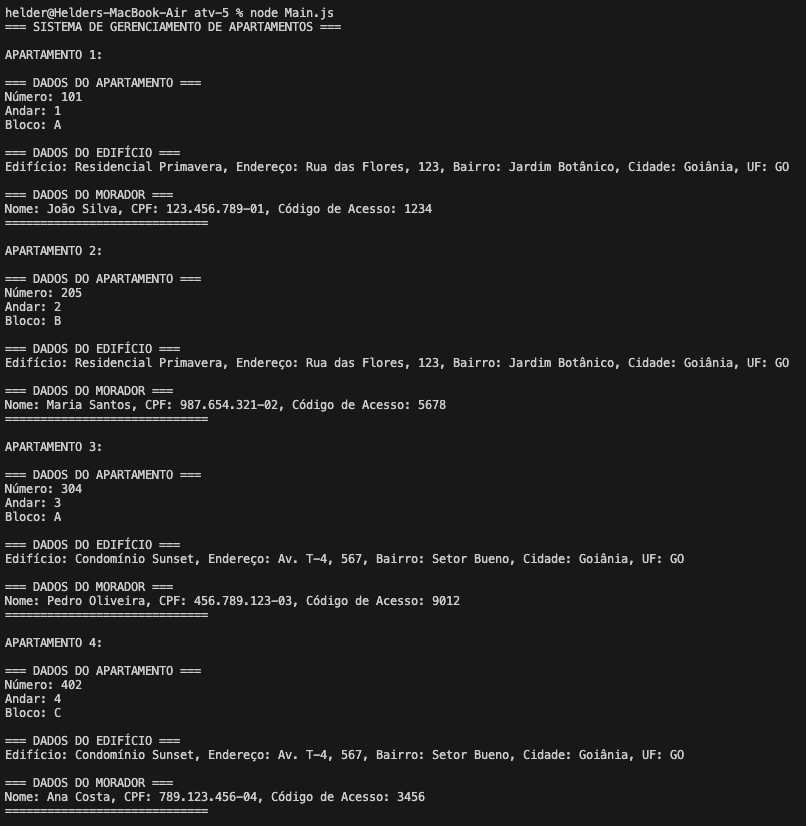

# Sistema de Gerenciamento de Apartamentos - ATV-5

Este projeto implementa um sistema orientado a objetos para gerenciar apartamentos de edifícios, desenvolvido como atividade acadêmica para demonstrar conhecimentos em Programação Orientada a Objetos (OOP), herança, composição e design patterns.

## 📋 Objetivo da Atividade

Implementar um sistema de classes para representar apartamentos de edifícios seguindo o diagrama UML fornecido, demonstrando:
- **Herança**: Classe `Morador` herda de `Pessoa`
- **Composição**: Classe `Apartamento` contém instâncias de `Edificio` e `Morador`
- **Encapsulamento**: Métodos getters, setters e construtores
- **Polimorfismo**: Métodos de exibição específicos para cada classe

## 🏗️ Arquitetura do Sistema

### 📐 **Diagrama UML Implementado**

O sistema segue o diagrama UML com as seguintes classes:

#### 🧑 **Classe Pessoa** (Superclasse)
**Descrição:** Classe base para representar uma pessoa com informações básicas.

**Atributos:**
- `nome`: String - Nome da pessoa
- `cpf`: String - CPF da pessoa

**Métodos:**
- `constructor(nome, cpf)`: Construtor da classe
- `getNome()` / `setNome(nome)`: Getter e setter para nome
- `getCpf()` / `setCpf(cpf)`: Getter e setter para CPF
- `mostrarDadosPessoa()`: Retorna dados formatados da pessoa

#### 👤 **Classe Morador** (Herda de Pessoa)
**Descrição:** Representa um morador do apartamento com código de acesso.

**Atributos herdados:**
- `nome`: String (herdado de Pessoa)
- `cpf`: String (herdado de Pessoa)

**Atributos próprios:**
- `codigoAcesso`: String - Código de acesso do morador

**Métodos:**
- `constructor(nome, cpf, codigoAcesso)`: Construtor com super()
- `getCodigoAcesso()` / `setCodigoAcesso()`: Getter e setter para código
- `mostrarDadosMorador()`: Retorna dados completos do morador

#### 🏢 **Classe Edificio**
**Descrição:** Representa um edifício com suas informações de localização.

**Atributos:**
- `nome`: String - Nome do edifício
- `endereco`: String - Endereço completo
- `bairro`: String - Bairro onde está localizado
- `cidade`: String - Cidade
- `uf`: String - Unidade federativa

**Métodos:**
- `constructor(nome, endereco, bairro, cidade, uf)`: Construtor
- Getters e setters para todos os atributos
- `mostrarDadosEdificio()`: Retorna dados formatados do edifício

#### 🏠 **Classe Apartamento**
**Descrição:** Representa um apartamento específico com referências para edifício e morador.

**Atributos:**
- `numero`: Number - Número do apartamento (ex: 101, 205)
- `andar`: Number - Andar onde está localizado
- `bloco`: String - Bloco do apartamento
- `edificio`: Edificio - Referência para instância de Edifício
- `morador`: Morador - Referência para instância de Morador

**Métodos:**
- `constructor(numero, andar, bloco, edificio, morador)`: Construtor
- Getters e setters para todos os atributos
- `mostrarDadosApartamento()`: Exibe dados completos (apartamento + edifício + morador)

#### ⚡ **Classe Main**
**Descrição:** Classe principal que demonstra o uso do sistema.

**Funcionalidades:**
- Cria 5 instâncias de apartamentos com dados completos
- Instancia edifícios e moradores necessários
- Executa o método `mostrarDadosApartamento()` para cada apartamento
- Fornece saída tanto para console quanto para interface web

## 🎨 Tecnologias Utilizadas

- **HTML5**: Estrutura semântica da interface
- **CSS3**: Estilos avançados com gradientes, animações e responsividade
- **Bootstrap 5.3**: Framework CSS para componentes e grid system
- **Bootstrap Icons**: Ícones contextuais para melhor UX
- **JavaScript ES6**: Classes, herança, métodos e manipulação do DOM
- **POO (OOP)**: Programação Orientada a Objetos com herança e composição

## 🚀 Como Visualizar o Projeto

### Opção 1: Interface Web Interativa
1. Navegue até a pasta `atv-5`
2. Abra o arquivo `index.html` no navegador
3. Clique em "Executar Sistema" para ver os resultados
4. Visualize tanto os cards visuais quanto o console output



### Opção 2: Execução via Console (Node.js)
1. Instale Node.js no sistema
2. Navegue até a pasta `atv-5`
3. Execute: `node Main.js`
4. Veja a saída no terminal



## 📁 Estrutura do Projeto

```
atv-5/
├── index.html              # Interface web principal
├── script.js               # Lógica de interface e eventos
├── styles.css              # Estilos customizados e responsivos
├── Pessoa.js               # Classe Pessoa (superclasse)
├── Morador.js              # Classe Morador (herda de Pessoa)
├── Edificio.js             # Classe Edificio
├── Apartamento.js          # Classe Apartamento (composição)
├── Main.js                 # Classe principal com execução
├── README.md               # Este arquivo
└── images/                 # Screenshots do projeto
    ├── image.png
    ├── image-1.png
    └── image-2.png
```

## 🔧 Funcionalidades Técnicas Avançadas

### Programação Orientada a Objetos
- **Herança Real**: `Morador extends Pessoa` com uso de `super()`
- **Composição**: `Apartamento` contém instâncias de `Edificio` e `Morador`
- **Encapsulamento**: Métodos getters/setters para controle de acesso
- **Polimorfismo**: Métodos `mostrarDados*()` específicos para cada classe

### Recursos de Interface
- **Cards Interativos**: Visualização moderna dos dados de cada apartamento
- **Console Output**: Saída formatada em estilo terminal
- **Animações CSS**: Efeitos de entrada escalonados para os cards
- **Design Responsivo**: Layout adaptável para dispositivos móveis
- **Feedback Visual**: Estados de hover, loading e sucesso

### Arquitetura de Código
- **Separação de Responsabilidades**: Uma classe por arquivo
- **Compatibilidade Dupla**: Funciona tanto no navegador quanto no Node.js
- **Interceptação de Console**: Captura saída do console.log para interface
- **Módulos JavaScript**: Organização limpa e reutilizável

## 💡 Recursos Adicionais Implementados

### Além dos requisitos básicos:
- **Interface Gráfica Completa**: Sistema web interativo ao invés de apenas console
- **Visualização em Cards**: Dados organizados em cards modernos e responsivos
- **Múltiplos Edifícios**: Sistema suporta apartamentos de diferentes edifícios
- **Console Híbrido**: Mantém saída de console + interface visual
- **Animações Escalonadas**: Cards aparecem em sequência com delays
- **Design Moderno**: Gradientes, blur effects e sombras
- **Compatibilidade Universal**: Roda no navegador e no Node.js
- **Dados Realistas**: Informações fictícias mas plausíveis para Goiânia/GO

## 🏛️ Dados de Demonstração

### Edifícios Criados:
1. **Residencial Primavera** - Jardim Botânico, Goiânia/GO
2. **Condomínio Sunset** - Setor Bueno, Goiânia/GO  
3. **Edifício Vista Verde** - Setor Sul, Goiânia/GO

### Apartamentos Cadastrados:
1. **Apt 101** - Bloco A, 1º andar (João Silva)
2. **Apt 205** - Bloco B, 2º andar (Maria Santos)
3. **Apt 304** - Bloco A, 3º andar (Pedro Oliveira)
4. **Apt 402** - Bloco C, 4º andar (Ana Costa)
5. **Apt 150** - Bloco B, 15º andar (Carlos Ferreira)

**Para visualizar o projeto, abra o arquivo `index.html` em seu navegador e clique em "Executar Sistema"!** 🌐